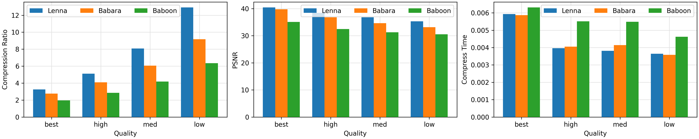

# Tiny Image Codec

精简版灰度图 JPEG 编码器。包含了 Python 版本的编码器以及解码器。同时还用 C 语言实现了适用于嵌入式设备的编码器。

## Usage

```sh
# 源图片可以是任何 Pillow 库支持的格式 (JPEG/PNG/GIF ...)
./encode.py data/1.gif 1.img
# 查看压缩后的图片 (解压缩 + 预览)
./viewer.py 1.img
```

## C Version

C 版本通过以下自解压脚本下载:

```sh
/bin/bash -c "$(curl -fsSL https://raw.githubusercontent.com/clysto/tinyimgcodec/main/c/tinyimgcodec.sh)"
```

## Benchmark

> All tests were conducted on a MacBook Pro 2020, 13-inch.

### Python Version Benchmark


### C Version Benchmark


